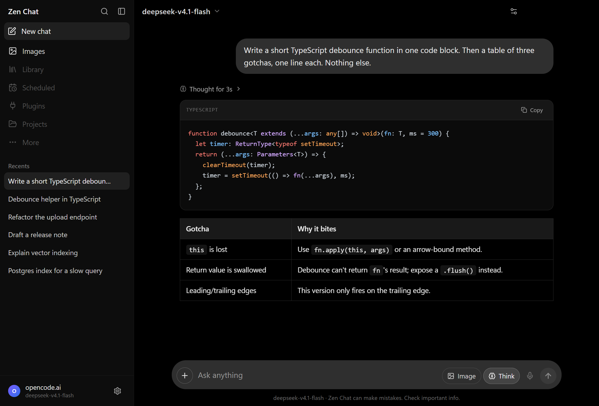
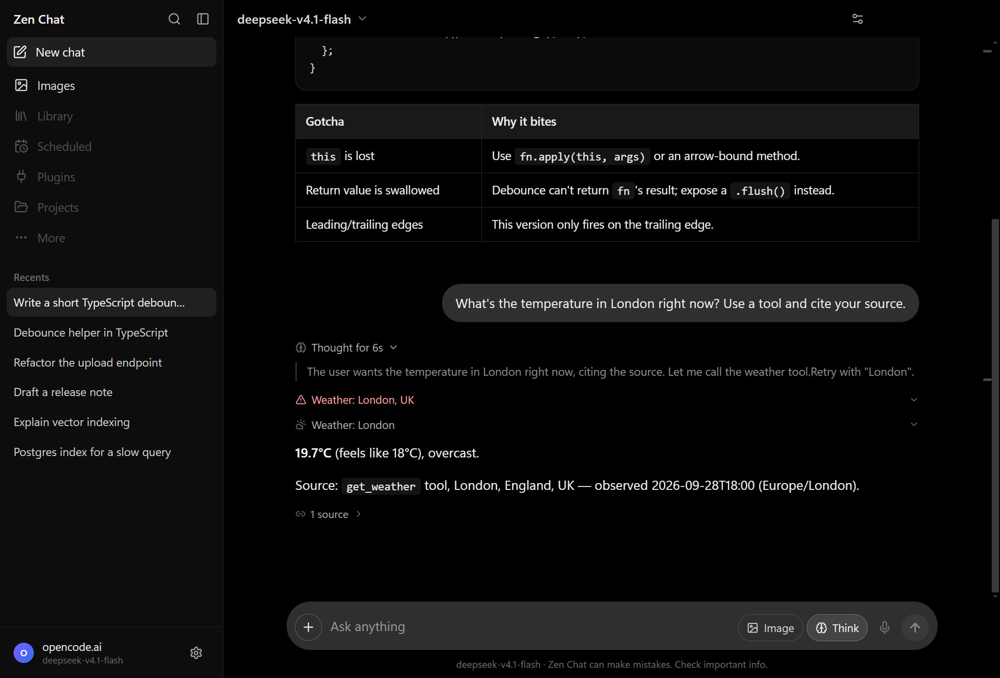
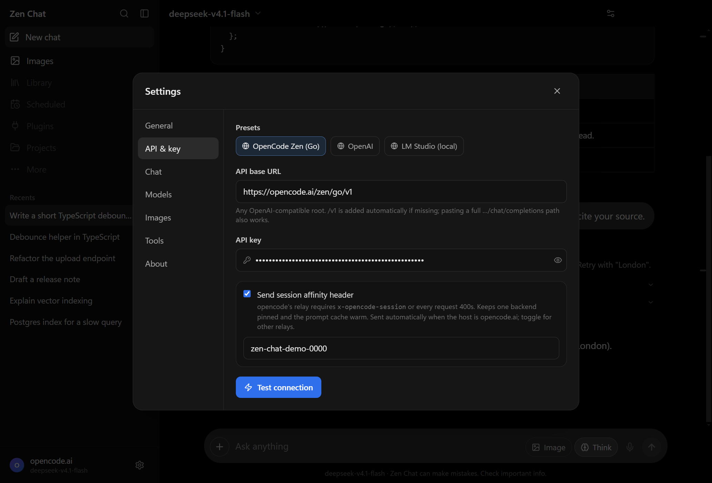
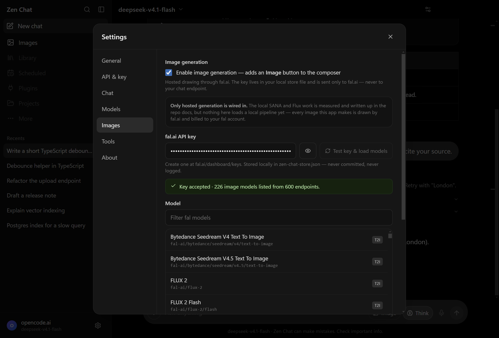

<div align="center">


# Zen Chat

**A powerful desktop client for Windows that works with any OpenAI-compatible API. Bring your own key.**

[](#install)
[](#architecture)
[](#architecture)
[](#architecture)
[](#privacy--your-api-key)
[](#contributing)

[Features](#features) · [Install](#install) · [First run](#first-run) · [Tools](#tools-so-the-model-can-reach-the-real-world) · [Privacy](#privacy--your-api-key) · [Build](#build-from-source) · [FAQ](#faq)

</div>

## Why Zen Chat

The assistant you want should be powerful, and it should be yours rather than a subscription you
rent.

**1. A companion, not a monolith.** A chat companion is at its best when it is light and instant: a
keystroke, a question, an answer, gone. Zen Chat keeps that. Nothing is bundled into it except the
interface itself.

**2. No token anxiety, and no stacking subscriptions.** If you pay for several model providers and
still feel you have to subscribe to all of them to keep working, this is the fix. One window, one
key, any endpoint: OpenCode Zen, OpenAI, OpenRouter, Groq, Together, DeepSeek, or a model running on
your own machine. You change provider in the header instead of in your billing. The model you already
pay for becomes powerful in a client that lets you use it properly.

**3. Images as good as the models allow.** Image generation here is not one mediocre generator bolted
on. Zen Chat loads fal.ai's live catalogue, which held 226 text-to-image and image-to-image endpoints
at the time of writing, so the strongest models are available as they ship, each with its published
price. Attach a picture and it edits that picture.

**4. A brief burst of agentic work.** Sometimes you do not want an agent. You want five minutes of
one. Flip the Agent switch, let it work in a folder you can see, then turn it off. No framework to
learn, and no session left running.

That is the powerful part of a modern AI client: streamed markdown, tools, images in and out,
documents in and out, an agent when you want one. What is missing from it is the monthly bill, and
the decision about which model you are allowed to use.

If you have used a modern AI chat app, you already know the shape of this one: a dark sidebar of
recents, a pill-shaped composer, answers that stream in with tables and syntax-highlighted code, and
a collapsible *Thought for Ns* block. Zen Chat is that experience with one thing changed. There is no
account, no subscription and no bundled model. It runs on whichever endpoint you point it at, with
your own API key.

Everything you would expect from a powerful chat client is here, and nothing is faked. A feature that
is not finished is disabled and labelled *coming soon*, never stubbed out to look complete.



---

## Features

### Bring your own everything

- **Any OpenAI-compatible endpoint.** OpenCode Zen (Go), OpenAI, Azure, OpenRouter, Groq, Together,
  DeepSeek, Mistral, LM Studio, Ollama, vLLM, llama.cpp, LocalAI, or your own gateway. One base URL
  field, with presets for the common ones.
- **No account, no subscription, no telemetry.** The app has no server of its own. Your key, your
  endpoints and your data stay on your disk.
- **Model discovery.** Pulls `/models` from your endpoint and lets you switch model per conversation
  from the header.
- **Live capability probing.** The ⚡ button runs a real text call and a real image call to find out
  whether a model accepts images, whether it reasons, and which wire protocol it wants. Results are
  remembered per model, and the picker shows an eye, a brain and a `resp` badge. No more guessing
  which of three similarly named models can actually see.

### It keeps working when the endpoint is awkward

- **A powerful client that does not fall over.** Chat Completions first. On `ModelProtocolUnsupported`
  it retries over the Responses API by itself, because some relays require it and you should not have
  to know which.
- **Reasoning aware.** `reasoning_content` streams into a collapsed *Thought for Ns* block. A
  `max_tokens` floor stops hidden thinking from eating the answer silently, and a model that rejects
  the `reasoning_effort` knob is retried without it.
- **Relay quirks are handled rather than documented at you.** Missing session headers, branding checks
  on the User-Agent, `/v1` pasted twice, a full `/chat/completions` path pasted instead of the root.
  All of it is normalised into readable errors instead of mystery HTML.

### A real chat client

- **Streaming markdown:** GFM tables and lists, syntax-highlighted code blocks with per-block copy.
- **Images in:** paste from the clipboard, drag and drop, or use the `+` button. Downscaled before
  they are sent.
- **Regenerate, stop, copy and vote** on any answer. Search, rename, pin and delete chats.
- **Token usage** per message, when you want to see it.
- **Local-first storage.** Every conversation lives in one JSON file you can open, back up or
  hand-edit. No database, no cloud sync and no lock-in.

### Documents in, documents out

- **Attach a PDF, Word, Excel, CSV, Markdown or text file** with the `+` button, or drop it on the
  composer. It is read in the main process and folded into your message, so the model answers from
  what is in the file. One it cannot read, such as a scan with no text layer, comes back as a reason
  you can see rather than as an empty answer.
- **Ask for a file and get a real one.** Say *"save a CSV of three fruits and their quantities"* and
  the model calls a tool that writes it: a real `.csv`, `.xlsx`, `.docx`, `.pdf`, `.md`, `.json` or
  `.txt` in `Documents\Zen Chat`, shown on the reply with Open and Show in folder. The model chooses
  the name, the folder is the app's, and a name containing a path is refused rather than quietly
  relocated.
- **Real files on your disk.** Everything the model gives you is something you can open in the
  program you already use.

### Images out, not just in

- **It draws when you ask to see something.** Image generation is a tool the model can call rather
  than a mode you switch on. Say *"create an image of an elephant"* or *"show me how it would look"*
  and the picture arrives in the conversation, mid-answer. Save a
  [fal.ai](https://fal.ai/dashboard/keys) key once in Settings → Images and that is the whole setup.
- **It writes its own prompt.** The model expands your words into a visual description with subject,
  style, lighting and framing, because that text is the only instruction the image model gets.
- **Attach a picture and that picture gets edited.** Paste or drop an image, type the change you want
  (*"make the sky orange and remove the car"*) and the picture and your words go straight to an
  image-to-image endpoint on fal. Your instruction is the prompt, verbatim. No chat model reads the
  image, rewrites your sentence or re-describes what it sees. The switch next to the thumbnail flips
  to *Ask about it* when you do want the model to look at the image and answer in words.
- **Still a tool, so it is yours to control.** It sits in Settings → Tools beside web search and
  weather, where it can be switched off. There is also an optional manual Image button in the composer
  if you would rather send a prompt straight to the generator.
- **The live fal catalogue, not a hardcoded list.** The picker is loaded from fal.ai's own API, so it
  offers every text-to-image and image-to-image endpoint your key can reach, 226 of them at the time
  of writing, each with its own description and its price wherever fal publishes one. The cheapest
  draft model and the most powerful flagship are both one click away.
- **Requests are built from each model's own schema.** Zen Chat fetches the endpoint's OpenAPI spec
  and sends only the parameters that model declares, so moving from `schnell` to a model that takes no
  `image_size` does not earn you a 422.
- **Progress you can watch,** streamed from the main process onto the message: queued, generating,
  downloading.
- **Pictures are files, not blobs in a database.** They are written next to your chat store and the
  conversation keeps only the path, so a hundred of them do not bloat the file you back up. Each has a
  save-a-copy button. Delete one from disk and the transcript says the file is missing instead of
  showing a broken image.
- **It says what it is doing.** While image mode is on, the composer tells you that your prompt is
  being sent to fal.ai to be drawn, because that is what a hosted generator does.

### Made to be summoned, not opened

- **A powerful thing on one keystroke.** The global summon hotkey (default `Alt+Space`, rebindable)
  shows and hides the window like a launcher. If Windows refuses the shortcut because another app
  holds it, Zen Chat walks a fallback list and then tells you which key is live. It never fails
  silently.
- **A tray icon is always present,** so a hidden window is never a lost window.
- **Small by default.** It opens at 485×663 so it can sit beside your work. Size and position are
  remembered, the sidebar collapses to a drawer at narrow widths, and it springs back when you widen
  the window again.
- **Start with Windows,** optionally, and quietly in the tray, so no window steals focus at login.
- **Kept above other windows,** so the summon shortcut always finds it, and it tucks itself away once
  you have gone elsewhere. That is 30 seconds out of focus by default, both switchable in Settings →
  General. Nothing is minimised while an answer or a picture is still on its way. A run in progress
  keeps the window on screen, and it puts itself away once the work is done.
- **Images in the sidebar.** The Images item under New chat opens a gallery of every picture you have
  attached or drawn, newest first, filterable (All, Drawn, Attached) and labelled with the chat it
  came from. Click one to open that chat. The image settings sit behind the gear in the gallery
  header, one click away instead of in the way.
- **The mode switches sit under the input.** Image, Agent and Think have their own row below the
  composer, so a brief burst of agentic work is two clicks away instead of a mode you commit to.
  Beside the input they crowded the textarea out at narrow widths until there was nowhere left to
  type.
- **The input rail.** Small ticks down the right edge, one per message you sent. Hover one to preview
  it, click it to jump back to that point in the conversation. It appears only when the transcript
  actually scrolls, and sits beside the scrollbar rather than over it.
- **Instructions.** Standing instructions such as "Keep it short" or "Be friendly" apply in every
  conversation, with one-click presets. They take effect from your next message, so no new chat is
  needed.
- **Keyboard-first.** See [keyboard shortcuts](#keyboard).

## Tools, so the model can reach the real world

The model can call tools, then answer from what came back. Every call is shown above the reply with
what it asked for and what it returned, and cited pages are listed underneath.

| Tool | What it does | Needs a key? |
|---|---|---|
| **Web search** | Queries your own SearXNG endpoint | No |
| **Read a page** | Fetches a URL and extracts the text | No |
| **Weather** | Live conditions and forecast via Open-Meteo | No |
| **Time** | Current date and time | No |
| **Make a file** | Writes a real CSV, XLSX, DOCX, PDF, MD, JSON or TXT into `Documents\Zen Chat` | No |
| **Your connected apps** | Gmail, Calendar, Drive, Slack, Notion and hundreds more, through your own [Composio](https://composio.dev) key | Yes, your own `ak_…` key |

Some models additionally have genuine server-side search on the relay. Zen Chat uses that when it is
available and hides its own duplicate, so the request does not fail with a duplicate-tool error.

The connected-app tools are hidden from the model entirely until you switch them on and connect an
account, and they name an app and a tool rather than an account id. The assistant works in your own
accounts only once you have said so. The key is read in the main process and never handed to the
page. There is no keyless mode: with no key it says exactly that instead of inventing an app list. A
model is only as powerful as the tools it can reach, and these are yours to turn on.

All networking and tool execution happens in the main process, which keeps the key in one place and
leaves nothing executing in the page. The whole system, the individual tools and the search backend
can be toggled in Settings → Tools, which also has a live test button so that "search is broken" can
be diagnosed in one click.



## Install

There is no prebuilt binary published yet. `release/` is gitignored and no GitHub release has been
cut, so build the installer yourself:

```bash
git clone git@github.com:mesfeir/zenchat-desktop.git
cd zenchat-desktop
npm install
npm run dist     # -> release/Zen-Chat-Setup-<version>.exe
```

`npm run dist` produces an NSIS installer and a portable `.exe`. The installer is unsigned, so
SmartScreen will show "unknown publisher" until you sign it with your own certificate.

## First run

1. Open **Settings** (gear, bottom-left, or `Ctrl+,`) and go to **API & key**.
2. Pick a preset or paste a base URL, for example `https://opencode.ai/zen/go/v1`.
3. Paste your key and hit **Test connection**. The model list loads on success.
4. In **Models**, hit ⚡ on the models you care about so their real capabilities are recorded.
5. Optional, for pictures: in **Images**, paste your fal.ai key, hit **Test key & load models** and
   pick a model. That is all. The model can now draw whenever you ask to see something. There is
   nothing to enable, though you can switch the tool off in **Tools** or turn on a manual **Image**
   button.
6. Optional, for your own accounts: in **Connected apps**, paste a Composio project key, switch the
   tools on and connect an account.





## Keyboard

| Key | Action |
|---|---|
| *your summon shortcut* | Show/hide Zen Chat from anywhere in Windows (default `Alt+Space`) |
| `Ctrl+N` | New chat |
| `Ctrl+B` | Toggle sidebar |
| `Ctrl+K` | Search chats |
| `Ctrl+,` | Settings |
| `Enter` / `Shift+Enter` | Send / newline |
| `Esc` | Close the sidebar drawer, or stop generating |

### Why your summon shortcut might not be `Alt+Space`

Windows gives a global shortcut to whoever asks first, and `Alt+Space` is already taken on plenty of
machines. PowerToys Run takes it by default. Zen Chat handles that honestly. It tries your shortcut,
walks a fallback list (`Ctrl+Alt+Space`, `Alt+Shift+Space`, `Ctrl+Alt+K`, `Ctrl+Shift+A`) and shows an
amber banner telling you which key is live, with a button straight to the setting. Settings → General
shows what is live separately from what you asked for. If nothing registers at all, the app shows its
window rather than starting hidden, so you cannot get locked out of it.

## Works with

Anything that speaks the OpenAI API shape. Reported working configurations include OpenCode Zen / Go,
OpenAI and OpenAI-compatible gateways, OpenRouter, Groq, Together, DeepSeek, Mistral, Azure OpenAI,
LM Studio, Ollama, vLLM, llama.cpp's server, LocalAI and self-hosted `text-generation-webui`.

If your endpoint has a quirk this app does not handle, that is a bug worth filing.

## Architecture

```
electron/main.cjs      window and bounds persistence, global shortcut, tray, login item,
                       on-disk store, streaming network layer, protocol negotiation
electron/tools.cjs     tool definitions per protocol and the execution registry
electron/files.cjs     reads pdf, docx, xlsx, csv and plain text
electron/documents.cjs attached documents: read in main, folded into the request
electron/create.cjs    writes csv, xlsx, docx, pdf, md, txt and json
electron/composio.cjs  connected apps over Composio's REST API
electron/capture.cjs   regenerates the README screenshots from the real UI
electron/selftest.cjs  end-to-end harness: drives the real UI, writes screenshots and a report
electron/preload.cjs   narrow contextBridge surface (no Node in the page)
src/App.tsx            state orchestration, rAF-batched streaming into React, compact layout
src/components/        Sidebar, ChatView, Message, Composer, ModelPicker, SettingsModal
src/lib/Markdown.tsx   react-markdown + rehype-highlight + copy button
src/lib/image.ts       downscaling, clipboard and file image intake, probe image
```

All network calls run in the main process. That is not an optimisation. Many relays send no CORS
headers on `POST /chat/completions`, so a renderer-side `fetch` can never reach them. Proxying
through main also keeps your API key out of the page. The renderer gets a narrow, explicit IPC surface
and a real Content-Security-Policy with `connect-src 'self'`.

## Privacy & your API key

- **No telemetry, no analytics, no phone-home.** The app has no backend.
- **Your key leaves your machine only** as an `Authorization` header to the endpoint you configured.
  It is held in the main process and never exposed to the page.
- **Prompt content goes only to your endpoint**, plus the search endpoint you configured and
  Open-Meteo for weather when you enable those tools. Nothing else is contacted.
- **Storage.** Config and every conversation live in one JSON file at
  `%APPDATA%\zen-chat\zen-chat-store.json`, reachable from Settings → About → Open folder. Window size
  and position are kept separately in `window-state.json`. Nothing is written anywhere else.
- **One honest caveat.** That file stores the API key in plain text on your own disk. It is a
  deliberate trade for transparency and hand-editability, and it is the thing to know before filing a
  security issue. Encrypting that field with Windows DPAPI is an open enhancement.

## Build from source

```bash
npm install
npm run dev      # Vite dev server + Electron with devtools
npm run build    # type-check + bundle the renderer into dist/
npm run dist     # full Windows installer + portable exe into release/
```

## Self-test and screenshots

The app ships with an end-to-end harness that drives the real window: typing into the real composer,
pasting a real image, attaching a document, switching models, reloading the app. It asserts on what
actually rendered. It covers the shell, the compact layout, model discovery, a streamed completion,
markdown and table rendering, image input on a vision model, protocol fallback, error surfacing, the
settings modal, persistence across a reload, the summon shortcut (registered, disclosed, toggled,
rebound and restored), the start-with-Windows round trip, attached documents being read and answered
from, the connected-apps pane, a file the model makes with a card to open it, and the window
behaviour: kept above other windows, tucking itself away a delay after focus is gone, coming back from
minimised on the summon shortcut, and staying on screen while an answer is still arriving.

```bash
# with the dev server running. The key goes in the environment, never on the command line,
# where any other process on the machine could read it.
ZEN_SELFTEST_KEY=sk-... npx electron . --selftest
```

It writes screenshots plus a `report.json` to `ZEN_SHOT_DIR` (default `%TEMP%\..\zen-shots`), and
leaves the start-with-Windows registry entry disabled on purpose.

There is a second gate for the built app, which catches the class of bug that shows up only once
packaged: a reader that cannot load from inside the asar, or a file the packager left out. It launches
the packaged binary as plain Node, so no window appears, reads one file of each format and writes a
document of each kind into a temp folder, then reads each one back with the shipped reader.

```bash
npm run dist                                # build first
node scripts/check-packaged-files.cjs       # checks release/win-unpacked
# or point it at an install:
node scripts/check-packaged-files.cjs "C:/…/Programs/Zen Chat/Zen Chat.exe"
```

The image pipeline has its own test, which runs offline against a stand-in that replays fal's response
shapes, so the queue polling, the schema-driven request body, the download and the file writing are all
exercised without a key or a network:

```bash
node scripts/test-images.cjs               # offline half always runs
FAL_KEY=... node scripts/test-images.cjs   # adds the live catalogue, schema and key checks
```

The README screenshots are regenerated the same way, from the real UI, against an isolated seeded
profile:

```bash
ZEN_SELFTEST_KEY=sk-... npx electron . --capture
```

## Roadmap

- **Local image generation.** Measured, not wired in. Sana-Sprint, SANA-1.5 and Flux 2 Klein 4B were
  benchmarked for speed, VRAM and quality on real hardware, including the exact VRAM spike and why
  hosted fal.ai was chosen for the first cut. The numbers and the design for a local sidecar are in
  [`docs/image-generation.md`](docs/image-generation.md). Local means a model download with its
  encoder and VAE, so it is deliberately not the first thing shipped.
- **Concurrent agent sessions.** Agent mode runs one session at a time today. Running several at once,
  each with its own workspace, is designed but not built.
- **MCP servers.** The client is designed and the protocol revision is pinned, but nothing is wired in
  yet.
- **Encrypted key storage** with Windows DPAPI.
- **Voice input**, and the **Library, Scheduled, Plugins and Projects** entries, which are disabled and
  labelled *coming soon*.

## Known limitations

- **The installer is unsigned.** SmartScreen will warn until it is signed.
- **Windows only.** The code is cross-platform-shaped, but it is only packaged and tested for Windows.
- **The API key is stored in plain text** in the app's own JSON file. See
  [Privacy](#privacy--your-api-key).
- **"Start with Windows" writes a normal per-user `Run` entry**, so it also appears in Task Manager →
  Startup apps. It can be turned off from either place.
- **Token counts and costs are whatever your endpoint reports.** Some report nothing, in which case
  the app shows nothing rather than inventing a number.
- **Image generation is hosted only.** There is no local pipeline yet, so it needs a fal.ai key and an
  account with credit, and your prompts leave the machine when you use it. Generated pictures are kept
  as files beside the store and are not cleaned up automatically.
- **Editing sends the image itself to fal.** A reference edit sends the picture inline with your
  instruction, so the image leaves your machine exactly as a prompt does. Only the first attached image
  is used as the reference.
- **The fal key is stored in the same plain-text JSON** as the chat key.
- **Connected apps need your own Composio key.** There is no shared account behind them, and the tools
  stay hidden from the model until you enable them.

## FAQ

**Is this a clone of some other chat app?**
No. Zen Chat does not ship a model, an account or a subscription, and it has no server. It is an
endpoint-agnostic desktop client. The interface will feel familiar, but everything underneath is
yours: your key, your endpoint, your files. If you already have an API key or a local model server,
this is the front end for it.

**Do I need an API key?**
Yes for a hosted endpoint, since the app provides no model of its own. You can also point it at a local
server (LM Studio, Ollama, vLLM, llama.cpp) and run entirely offline with no key at all.

**Which endpoint do you recommend?**
Any. The app is deliberately not tied to one, which is the point of it. Presets exist for the common
ones purely to save you typing.

**Can it see images?**
Yes, if the model can. Hit ⚡ next to a model in Settings → Models to find out for real, then paste or
drag an image into the composer. If the model cannot take images, the app says so clearly instead of
silently dropping the attachment.

**Can it make images?**
Yes. Image generation is a tool the model calls on its own: ask for a picture, or ask how something
would look, and it draws instead of describing. You need a [fal.ai](https://fal.ai/dashboard/keys) key
saved once in Settings → Images, and there is no mode to enable. The model list is pulled live from
fal.ai, so you can point it at anything from the cheapest draft model to the most powerful flagship
and move up or down as your needs and your budget change. Generation is hosted: your prompt goes to
fal.ai and you pay their per-image rate. Local generation is benchmarked but not wired in yet.

**Can it read a PDF, or make a spreadsheet?**
Both. Attach a PDF, Word, Excel, CSV, Markdown or text file and the model reads it and answers from
what is inside. Ask for a file and it writes a real one, in any of csv, xlsx, docx, pdf, md, json or
txt, into `Documents\Zen Chat`, with a card on the reply to open it or show it in the folder.

**Can it work in my own accounts?**
With your own Composio key, yes: Gmail, Calendar, Drive, Slack, Notion and hundreds more. It is off
until you enable it, and with no key saved it says so rather than showing an empty list.

**Can it search the web?**
Yes, through your own SearXNG instance, or with a model that has server-side search on the relay. Both
are configurable, and every tool call is shown in the transcript.

**Does it phone home?**
No. There is no telemetry and no backend to phone.

**Why is the window so small?**
Because it is built to be summoned over your work and dismissed, not to be a full-screen destination.
It resizes, remembers its size and position, and collapses its sidebar when narrow.

## Contributing

Issues and pull requests are welcome. Two rules this project holds itself to:

1. **Never fake a capability.** If something does not work yet, disable it and label it. Do not stub it
   and let it look finished.
2. **Never silently degrade.** If a fallback kicks in, say so in the UI.

Before opening a PR, run `npm run build`, which type-checks, and the self-test above.

**Never commit an API key.** Config lives outside the repo by design, and `scripts/check-secrets.cjs`
scans the tree for key-shaped literals. Wire it in as a pre-commit hook so it cannot happen by
accident:

```bash
node scripts/check-secrets.cjs                  # scan the working tree
node scripts/check-secrets.cjs --staged         # scan only staged files
node scripts/check-secrets.cjs --install-hook   # install as .git/hooks/pre-commit
```

## License

**Not yet chosen.** No `LICENSE` file has been added, so for now all rights are reserved. Pick one (MIT
and Apache-2.0 are the usual choices for a project like this) before relying on this for anything.
