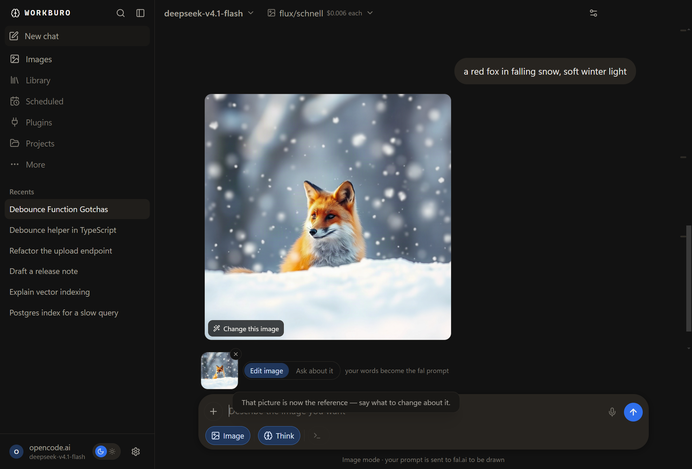
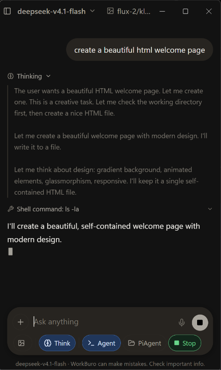
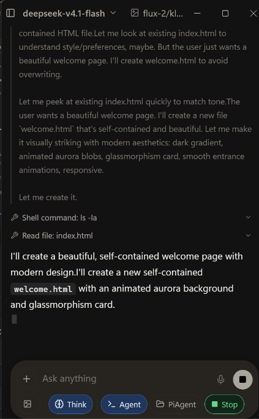
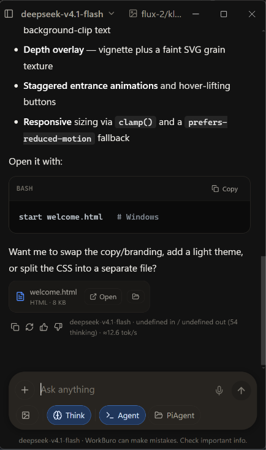

<div align="center">


# WorkBuro

**Press a key, ask, and get an answer you can use. A small Windows client that talks to any OpenAI-compatible endpoint, including a model running on your own machine.**

[](#install)
[](#build-from-source)
[](#build-from-source)
[](#privacy)
[](#contributing)

[What it is](#what-it-is) · [Why we made it](#why-we-made-it) · [What it does](#what-it-does) · [Main features](#main-features) · [Install](#install) · [First run](#first-run) · [Keyboard](#keyboard)

</div>

## What it is

**WorkBuro** is a **lightweight, powerful chat app for Windows** that talks to **any OpenAI-compatible LLM**, answers on **one keystroke**, can run a **model on your own machine** with **no account at all**, and turns any of them into an **agent** when a job needs hands.

## Why we made it

- The **best part** of an AI assistant is the **model**, and the **worst part** is everything in front of it: the **tab**, the **sign-in**, the **wait**. A **powerful** model deserves a **lightweight** window, not a browser tab and a queue.
- A **hotkey** beats a **tab**. **Alt+Space** over whatever you are doing, a question, an answer, gone. **Lightweight** enough to live on a keypress, and light enough to leave running all day.
- We wanted **quick access to agents** inside the same chat app. Flip **Agent** on and the model gets **hands** in a folder you can see, then flip it off again. No second app, no **terminal**, no session left running.
- It should **do something**, not only talk: ask for a spreadsheet and get a **real .xlsx** in a **real folder**.
- We wanted **no second subscription**. Point it at the endpoint you **already pay for**, or at a **model on your own machine**.
- The interface is **familiar**, and everything underneath is **yours**: your **key**, your **endpoint**, your **files**.
- It should be **honest**. If something does not work, it **says so** rather than quietly failing.


## What it does

- **It is summoned, not opened.** A **global hotkey** (**Alt+Space** by default, rebindable) brings a **lightweight window** over your work and puts it away again. A **tray icon** means a hidden window is never a lost one.
- **Answers you can use.** **Streamed markdown**, **tables**, **syntax-highlighted code** with a copy button, and **Stop**, **Regenerate** and **copy** on every reply. It looks like the **powerful** chat client you already know, and it is small enough to forget about.
- **Real files out.** Say "**save a CSV of three fruits and their quantities**" and you get a real **.csv**, **.xlsx**, **.docx**, **.pdf**, **.md**, **.json** or **.txt** in **Documents\WorkBuro**, shown on the reply with **Open** and **Show in folder**.
- **Documents in.** Attach a **PDF**, **Word**, **Excel**, **CSV**, **Markdown** or **text** file and the model answers from what is inside it. One it cannot read comes back as a **reason you can see**, not an empty answer.
- **Pictures both ways.** Ask to see something and it **draws it**. Send a picture and it can **change it from your words**, or **look at it and answer**.

  
- **A brief burst of agent work.** Flip **Agent** on and the model gets **shell** and **file** tools inside a **folder you can see**, then you flip it off again. Nothing installs or schedules in the background.
- **No key at all?** It will run a **lightweight model on your machine**. One **429 MB** download, then about a **second to an answer**, with **no account** and **no browser**.

<p align="center">
  
  
  
</p>

*The agent at work in a small window: it lists the folder, reads a file, writes one, and hands you the finished file with **Open** next to it. Same window, same keystroke, no second app.*

## Main features

- **Any OpenAI-compatible endpoint.** **OpenCode Zen**, **OpenAI**, **OpenRouter**, **Groq**, **Together**, **DeepSeek**, **Mistral**, **LM Studio**, **Ollama**, **vLLM**, **llama.cpp**, **LocalAI**, or **your own gateway**. One **base URL** field, with **presets** for the common ones.
- **Model discovery and real capability checks.** It reads **/models** from your endpoint, and the **lightning button** makes a **real call** to find out whether a model takes **images**, whether it **reasons**, and which **wire protocol** it wants. What it learns is **remembered**, so you stop guessing which of three similarly named models can really see.
- **It copes with awkward endpoints.** **Chat Completions** first, and the **Responses API** by itself when an endpoint refuses the first. Relay quirks such as **session headers**, a missing **User-Agent**, or **/v1** pasted twice become **readable errors** instead of mystery HTML.
- **Tools the model can call.** **Web search** through your own **SearXNG**, **read a page**, **weather**, **time**, **make a file**, your own **connected apps** through your own **Composio** key, and any **MCP servers** you add.

  
- **Images.** **fal.ai**'s live catalogue, each endpoint with its **published price**, prompts written by the model, **progress** while it draws, and a **gallery** in the sidebar of everything you have sent or drawn.

  
- **No server to run.** Nothing to install on a box, no container, no sign-in screen. If you have tried **Open WebUI** and wanted the same thing without running a server, this is that: an **alternative to a ChatGPT subscription** in the way that matters, because the key, the endpoint and the files stay yours.
- **Made for a desktop.** A **small window** that **remembers its size**, **starts with Windows** if you want, **stays above** other windows, and **tucks itself away** 30 seconds after you leave it, unless an answer is still arriving.
- **Local-first and quiet.** **Lightweight** where it counts: **no telemetry** and no backend. Every conversation lives in **one JSON file** you can open, back up or hand-edit.
- **Small enough to read.** A few thousand lines of **TypeScript** and **CommonJS**, **powerful** without being heavy, and a **self-test** that drives the **real window** instead of a mock.

## Common questions

**Is this a ChatGPT alternative?** In the way people usually mean it, yes. It is a **chat app that works like ChatGPT**: streaming answers, a composer, a sidebar, an image mode, tools and agents. What is different is the model behind it, which is **whatever you point it at**, not one company's model behind one company's account. It is **not affiliated with OpenAI** and it does not claim to be ChatGPT.

**Is there a free option?** The app costs nothing and there is no subscription. With no API key at all it will download a **lightweight model** (429 MB) and run it **on your machine**, which is free to use from then on. If you already pay for a model, it uses your **own key** instead, and either way there is no second bill.

**Why not just use Open WebUI?** Open WebUI is a web app you install, run and sign into, usually in Docker and usually on a server you maintain. WorkBuro is a **desktop app for Windows**: install it, press **Alt+Space**, get an answer, close it. No server, no browser, no account. If you want a shared web UI for a team, use Open WebUI. If you want a **desktop client** that writes a **real file** into a **real folder**, this is the one.

**Do I need an account?** No. There is no sign-in, no telemetry, and no backend to sign into.

**Does it only work with one model?** No, and that is the point. **OpenAI**, **OpenRouter**, **Groq**, **DeepSeek**, **Mistral**, **OpenCode Zen**, **LM Studio**, **Ollama**, **llama.cpp**, **vLLM**, **LocalAI**, or **your own gateway**. If it speaks the **OpenAI-compatible** API, it works.

## Install

Download from [**Releases**](../../releases):

| File | What it is |
|---|---|
| **`WorkBuro-Setup-x.y.z.exe`** | The installer. Start menu entry, uninstaller, optional start with Windows. |
| **`WorkBuro-x.y.z-portable.exe`** | One file, nothing installed. Run it from anywhere. |

Both are **unsigned**, so **SmartScreen** will say "unknown publisher" until that changes. Choose *More info*, then *Run anyway*. `SHA256SUMS.txt` is on the release if you want to check what you downloaded.

Or build it yourself:

```bash
git clone git@github.com:mesfeir/workburo.git
cd workburo
npm install
npm run dist     # -> release/WorkBuro-Setup-<version>.exe
```

`npm run dist` makes an **NSIS installer** and a **portable .exe**.

## First run

1. Open **Settings** (the gear, bottom-left, or **Ctrl+,**) and go to the **connection tab**.
2. **No key yet?** The first thing on that tab offers to run a **small model on this machine**. **429 MB**, one download, and it answers from then on with **no account**.
3. **Have a key?** Pick a **preset**, or paste a **base URL** such as `https://opencode.ai/zen/go/v1`, paste your **key**, and press **Test connection**. The model list loads on success.
4. In **Models**, press the **lightning button** on the models you care about so their **real abilities** are written down.
5. For pictures, paste a **[fal.ai](https://fal.ai/dashboard/keys)** key in **Settings → Images**. That is the whole setup.


## Keyboard

| Key | Action |
|---|---|
| *your summon shortcut* | Show or hide WorkBuro from anywhere in Windows (default **Alt+Space**) |
| **Ctrl+N** | New chat |
| **Ctrl+B** | Toggle sidebar |
| **Ctrl+K** | Search chats |
| **Ctrl+,** | Settings |
| **Enter** / **Shift+Enter** | Send / newline |
| **Esc** | Close the sidebar drawer, or stop generating |

If **Alt+Space** is already taken, which happens on plenty of machines, WorkBuro walks a **fallback list** and shows an **amber banner** naming the key that is live. It never fails silently, and it never leaves you unable to reach the window.

## Privacy

- **No telemetry**, no analytics, no backend. There is nothing to phone home to.
- **Your key stays on your machine.** It is held in the **main process** and leaves only as an **Authorization header** to the endpoint you configured. It is never exposed to the page.
- **Prompts go to your endpoint**, plus your **search endpoint** and **Open-Meteo** if you switch those tools on. Nothing else is contacted.
- **One honest caveat.** The key is stored in **plain text** in the app's own JSON file at **%APPDATA%\WorkBuro\zen-chat-store.json**. That is a trade for transparency and hand-editability, and it is worth knowing before you file a security issue. Encrypting it with **Windows DPAPI** is on the list.

## Build from source

```bash
npm install
npm run dev      # Vite dev server plus Electron with devtools
npm run build    # type-check and bundle the renderer into dist/
npm run dist     # full Windows installer and portable exe into release/
npm test         # the offline suites, including the local model
```

There is also an **end-to-end harness** that drives the **real window**: typing into the real composer, attaching a real document, switching models, reloading the app, and asserting on what actually rendered. The key goes in the **environment**, never on a command line where another process could read it.

## Known limitations

- **The installer is unsigned.** **SmartScreen** will warn until it is signed.
- **Windows only.** The code is written cross-platform, but it is only packaged and tested on Windows.
- **Image generation is hosted.** It needs a **fal.ai** key, and your prompts leave the machine when you use it. Local generation was measured on real hardware and the numbers are in [`docs/image-generation.md`](docs/image-generation.md), but it is not wired in yet.
- **MCP servers are stdio only.** A server is a program run on this machine. Servers reachable only over **HTTP** are not supported yet.
- **A very small model is a demo, not a worker.** The **429 MB** model that answers in about a second is good for a question and a reply. It is not the model to hand **shell tools** to.

## Contributing

Issues and pull requests are welcome. Two rules this project holds itself to:

1. **Never fake a capability.** If it does not work yet, **disable it and label it**. Never stub something so it looks finished.
2. **Never silently degrade.** If a fallback kicks in, **say so in the UI**.

Run `npm run build`, which type-checks, before opening a pull request. And never commit a key: `scripts/check-secrets.cjs` scans the tree for **key-shaped literals** and can install itself as a **pre-commit hook**.

## Licence

**Not chosen yet.** No `LICENSE` file has been added, so all rights are reserved for now.
