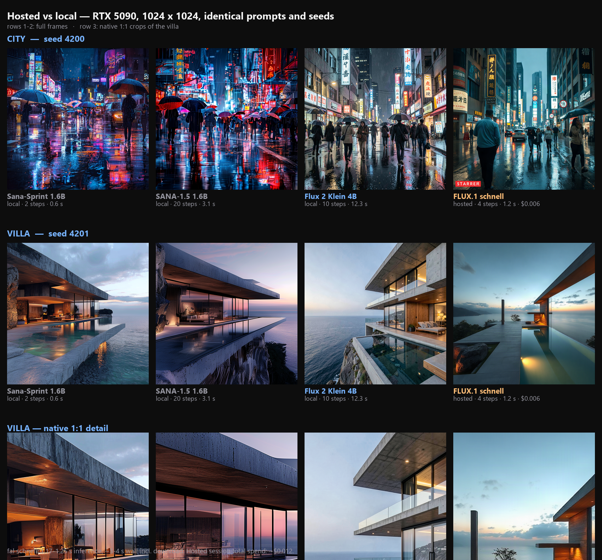
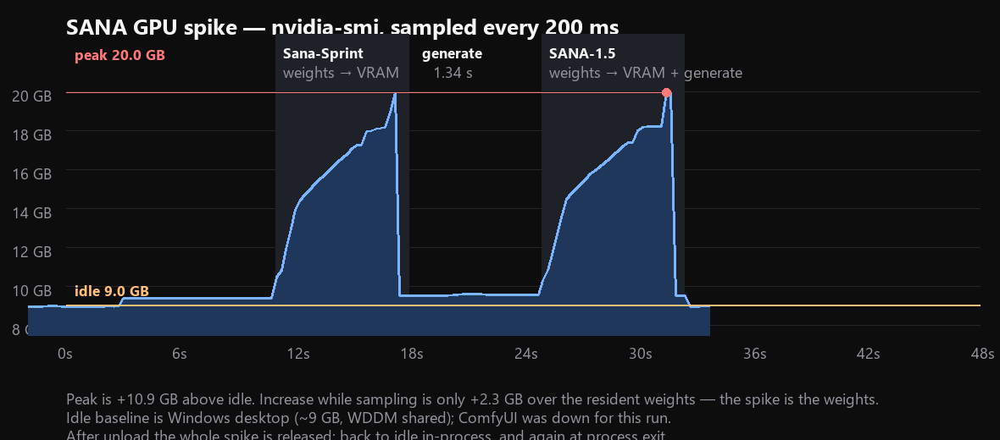

# Image generation — research notes (not implemented)

**Status: researched, measured, deliberately not shipped.** Zen Chat has no image
generation. The **Images** entry in the sidebar stays disabled and labelled *coming soon* —
it is not a stub, and nothing in this document is wired into the app.

This file exists so the work isn't repeated. Every number below was measured on real
hardware with real weights; the scripts and checkpoints live outside this repo (they are
~26 GB of model files and are not redistributable from here).

## The question

Could the app generate images locally on demand — without the user starting ComfyUI, and
without a model holding the GPU hostage while it sits idle?

## Method

- **Card:** RTX 5090, 32 GB, compute capability (12, 0). Python 3.12 venv, torch 2.14+cu130,
  diffusers 0.40, transformers 5.17.
- **VRAM** measured two independent ways and reported as *deltas*, never absolutes:
  `torch.cuda.memory_allocated()/max_memory_allocated()` inside the process, and an external
  `nvidia-smi` poll every 200 ms into a CSV alongside per-phase epoch timestamps. See
  `sana-vram-spike.png` below.
- **Quality** judged by eye on full frames *and* native 1:1 crops, on the same prompts and
  seeds across models. Downscaled comparison sheets hide exactly the detail being judged.

## Local models, 1024×1024

| Model | Params | On disk | Cold load | Warm image | VRAM resident | VRAM peak | Licence | Quality |
|---|---|---|---|---|---|---|---|---|
| Sana-Sprint 1.6B (2 steps) | 1.6 B | 9.1 GB | 8.2–18.4 s | **0.46 s** | 9.07 GB | 10.86 GB | Apache-2.0 | draft |
| SANA-1.5 1.6B (20 steps) | 1.6 B | 9.1 GB | 7.6–18.4 s | 1.55 s | 9.06 GB | 10.85 GB | Apache-2.0 | fair |
| Flux 2 Klein 4B (10 steps) | 3.88 B | ~8.2 GB | ~24 s | 12.3 s | ~16 GB | 18.56 GB | Apache-2.0 | **best** |

- **Cold load is not a fixed number.** The same checkpoint measured 10.9 s and later 18.4 s —
  re-reading tens of GB evicts the OS disk cache. Quote a range.
- **VRAM tracks the text encoder, not the step count.** Both SANA variants sit at ~9.06 GB
  whether sampling 2 steps or 20, because the ~5.2 GB Gemma-2 encoder dominates. Fewer steps
  buys speed only.
- **Generation time is contention-sensitive.** SANA-1.5's 20 steps measured 3.15 s while
  ComfyUI held ~19 GB of the card, and 1.55 s with the GPU idle. A contended number compared
  against an idle one silently doubles the apparent gap between models.

## The GPU spike, decomposed

The spike is the **weights**, not the act of sampling:

| Phase | Delta over idle |
|---|---|
| disk → RAM (`from_pretrained`) | +0.35 GB — CUDA context only |
| **weights resident in VRAM** | **+9.07 GB** |
| generation (activations) | +1.8 GB on top of resident |
| **total peak** | **~+11 GB** |

It all comes back: after `del` + `gc.collect()` + `empty_cache()` the card returns to idle
in-process, and process exit returns the last of it (9,211 MiB after exit vs 9,251 MiB
before). No leak, no residue.

**Measurement note:** `torch.cuda.mem_get_info()` and `nvidia-smi` disagree by a constant
~7.5 GB on this machine (Windows WDDM accounting). torch reported 1.67 GB idle / 13.05 GB
peak; nvidia-smi reported 9.25 GB / 20.46 GB for the same instants. The deltas agreed to
within 0.4 GB — which is why only deltas are quoted.

## Hosted fallback (fal.ai) — measured, and rejected

`POST https://fal.run/fal-ai/flux/schnell`, returned as a URL to download.

| | |
|---|---|
| Inference | 1.17–1.25 s |
| Wall clock incl. upload + download | 2.8–4.0 s |
| Price | $0.003 / MP, **billed rounded up to the nearest megapixel** |
| Cost at 1024×1024 | 1.049 MP → likely billed as 2 MP ≈ **$0.006/image** (~$0.60 per 100) |
| Cost at 1000×1000 | stays inside 1 MP and **halves it** |

The API response carries no cost field, so the round-up should be confirmed against a real
invoice. Quality on the same prompt and seed was **well below the free, local Klein 4B**
(~3.5–4/10 vs ~7.5–8/10): a glass facade with no mullions at all, no railing structure,
merged water/sky/concrete tones. It is a 1–4 step distilled model, so 4 steps is its
ceiling — no setting recovers the detail.

## Verdict

1. **Local generation can keep the GPU free.** The thing that holds this GPU is a resident
   ComfyUI holding ~19–20 GB with an empty queue — not generation. A lazy-load worker costs
   ~14 s per warm-tier image (disk → RAM → VRAM → sample) and **~0 GB between requests**,
   because these pipelines genuinely release their memory. That is the whole design goal, met
   without spending anything.
2. **Do not adopt hosted *schnell* as a quality tier.** It costs money and loses to a model
   that runs locally for free. Hosted only makes sense as a fallback for when the GPU is busy
   with something else — and then it is worth paying for a real tier (Qwen-Image at
   $0.02/MP ≈ $0.04/image) rather than the cheapest one.
3. **Flux 2 Klein 4B is the only candidate that produces architecture worth looking at** in
   this set, at ~4× the time and ~8 GB more VRAM than SANA-1.5. It also does instruction-based
   *editing* with reference images, not just text-to-image — which is what a photo-transform
   feature would actually need.
4. **Licences matter more than benchmarks.** SANA and Klein 4B are Apache-2.0. The
   Qwen-Image family is under a research/non-commercial licence and needs ~33 GB in bf16
   (GGUF quants bring the transformer to ~4.6–7.6 GB but make it a ComfyUI-only route), so it
   is out on both size and licence grounds.

## If it ever ships, the shape is

A small sidecar service in front of the models — `POST /generate {pipeline, prompt, size,
steps, seed} → PNG`, with pipelines described as data, a keep-warm timeout, and an honest
"loading model…" state in the UI so the first image of a session is never a silent 14-second
stall. It would load on demand and unload when idle, so the GPU is idle when you are not
generating.

Still open: which tier is the default, whether the encoder is parked on CPU (~4 GB less
resident, slower), and whether a GPU-busy fallback is worth wiring to a paid API at all.
